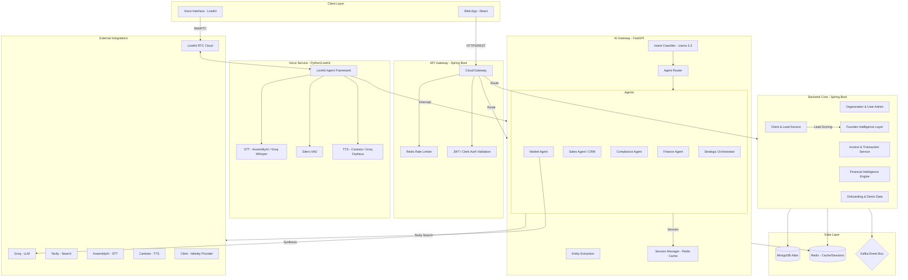

# 💸 MoneyOps: Intelligent Financial Orchestration

> **Status**: Phase 5 Complete (Smart CRM & Market Intelligence) 🚀
> **Architecture**: Distributed AI Microservices with Founder Intelligence Layer

MoneyOps is a next-generation financial platform that orchestrates **AI Agents** to handle invoicing, payments, CRM, and business intelligence via **Voice** and **Chat** interfaces. It leverages a "CEO Brain" architecture to go beyond simple CRUD operations.

---

## 🏗️ System Architecture

---

## 🧠 Data Flow & Intelligence Pipeline

1. **Transcript Interception**: Speech is captured via LiveKit, transcribed (AssemblyAI/Groq), and intercepted by the `Voice Service`.
2. **Intent Classification**: The `AI Gateway` classifies input into Operational, Strategic, or Conversational intents using Llama 3.3.
3. **Founder Enrichment**: For actions like `CLIENT_CREATE`, the system automatically:
    - Infers industry and business type.
    - Calculates a Lead Score (CEO-level value assessment).
    - Generates Smart Notes for CRM (pitch angles, ESG compliance).
4. **Backend Execution**: Core services update MongoDB and broadcast events via Kafka.
5. **CEO Summary**: The `Orchestrator` synthesizes data from Finance, Market, and Compliance agents to provide an actionable voice response.

---

## 🚀 System Components

| Service | Tech Stack | Description |
| :--- | :--- | :--- |
| **Backend Core** | Java 17, Spring Boot, MongoDB | REST API, Business Logic, Organization Isolation |
| **API Gateway** | Spring Cloud Gateway, Redis | Traffic Routing, Auth, Rate Limiting |
| **AI Gateway** | Python, FastAPI, Groq | multi-Agent Orchestration, Tool Registry, LLM Synthesis |
| **Voice Service** | Python, LiveKit Agents | Real-time Voice I/O with VAD-split utterance buffering |
| **Frontend** | React, LiveKit SDK | Intelligent Web Dashboard & Voice UI |

---

## 🛠️ Technology Stack & Third-party APIs

- **LLM**: Groq (Llama 3.3 70B Versatile)
- **Voice**: LiveKit (Cloud), AssemblyAI (STT), Cartesia (TTS), Silero (VAD)
- **Search**: Tavily (Market Intelligence), SearchAPI
- **Auth**: Clerk (Identity & Organization Management)
- **Database**: MongoDB (Persistence), Redis (Context & Rate Limiting)
- **Infrastructure**: Kafka (Event Bus), Docker Compose

---

## 📚 Documentation

- **[Architecture Deep Dive](docs/architecture.md)**: Original design document. (Legacy reference)
- **[Troubleshooting](docs/troubleshooting_and_tradeoffs.md)**: Decisions on UUID representation and VAD split handling.
- **[Testing Results](docs/test_results.md)**: Latest pipeline verification.
