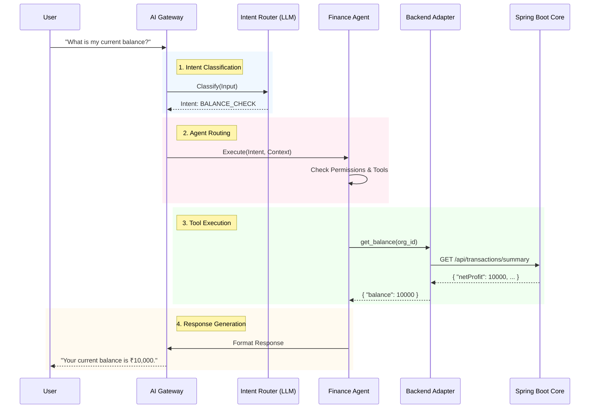
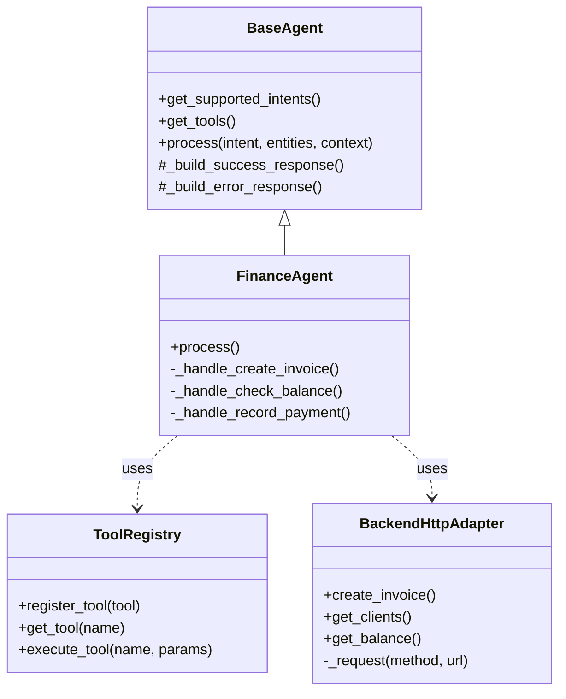

# MoneyOps: Intelligent Finance Orchestration Architecture

## Executive Summary
MoneyOps is **NOT** just a CRUD API. It is a distributed, intelligent orchestration system designed to autonomously manage financial operations through AI agents.

**Key capabilities:**
- **Multi-provider LLM Orchestration** (Groq, Anthropic, etc.)
- **Domain-Specific Agents** (Finance, Compliance, Sales)
- **Voice-to-Action Pipeline** (LiveKit → Voice Service → AI Gateway → Backend)
- **Complex State Management** (User, Business, and Session Context)
- **Event-Driven Workflow Engine**

---

## 1. High-Level Architecture

```mermaid
graph TD
    subgraph Clients
        WebApp[Web App (Chat/Admin)]
        VoiceClient[Voice Client (Mobile/Web)]
    end

    subgraph "Voice Service (Python/LiveKit)"
        LiveKit[LiveKit Server]
        STT[STT Service (AssemblyAI)]
        TTS[TTS Service (Cartesia)]
    end

    subgraph "AI Gateway (Python/FastAPI) - The Core"
        API_GW[FastAPI Layer]
        Router[Agent Router]
        
        subgraph Agents
            FinAgent[Finance Agent]
            CompAgent[Compliance Agent]
            SaleAgent[Sales Agent]
        end
        
        ToolReg[Tool Registry]
        Context[Context Manager]
        LLM_Adapter[LLM Adapter (Groq/Claude)]
    end

    subgraph "Backend Core (Java/Spring Boot)"
        SpringAPI[Spring Boot REST API]
        Auth[Security/Auth]
        BizLogic[Domain Logic]
    end

    subgraph Infrastructure
        Postgres[(PostgreSQL)]
        Redis[(Redis Cache)]
        Kafka{Kafka Event Bus}
        Celery[Workflow Workers]
    end

    %% Connections
    WebApp -->|HTTP/REST| API_GW
    VoiceClient -->|WebRTC| LiveKit
    LiveKit <--> STT
    LiveKit <--> TTS
    LiveKit -->|HTTP Stream| API_GW
    
    API_GW --> LLM_Adapter
    LLM_Adapter -->|External API| Groq[Groq/LLM Provider]
    
    API_GW -->|HTTP/REST| SpringAPI
    SpringAPI --> Postgres
    SpringAPI --> Kafka
    Kafka --> Celery
    Celery -->|Async Call| API_GW

    classDef core fill:#f9f,stroke:#333,stroke-width:2px;
    classDef infra fill:#ddd,stroke:#333,stroke-width:1px;
    class API_GW,SpringAPI,LiveKit core;
    class Postgres,Redis,Kafka,Celery infra;
```

---

## 2. The Decision Pipeline (Detailed Flow)

This requires **orchestration**, not just API calls. Here is the lifecycle of a single user request:



---

## 3. Agent System Design (Phase 4)

We implemented an extensible **Agent System** where each agent is a specialized decision maker.

### Class Structure



### Key Components

1.  **BaseAgent**: The abstract ancestor. Provides standard response formatting, error handling, and interface definitions.
2.  **ToolRegistry**: A central directory of all available capabilities (`create_invoice`, `check_balance`, etc.). It handles parameter validation before execution.
3.  **BackendHttpAdapter**: The bridge to the Java Backend. It handles:
    *   Authentication (passing JWTs)
    *   Error Normalization (converting Backend errors to Gateway exceptions)
    *   Type Safety (Pydantic models)

---

## 4. Why This Architecture?

| Challenge | Our Solution |
| :--- | :--- |
| **Complexity** | **Agent Abstraction**: Hides logic inside specialized agents. The Router just picks the right agent. |
| **Reliability** | **Backend Adapter**: Centralized error handling and retries. If the backend fails, we handle it gracefully. |
| **Scalability** | **Stateless Gateway**: The Gateway stores state in Redis/Context, enabling horizontal scaling of the Python service. |
| **Flexibility** | **Tool Registry**: Adding a new feature (e.g., "Tax Calculation") just means registering a new Tool, not rewriting the orchestrator. |

---

## 5. Deployment View

```mermaid
graph LR
    subgraph "Dev Environment"
        DevPC[Developer/Test Machine]
    end
    
    subgraph "Production (Docker/K8s)"
        LB[Load Balancer]
        
        GW_Pod[AI Gateway Pods (x3)]
        BE_Pod[Backend Core Pods (x2)]
        Worker_Pod[Celery Workers (x2)]
        
        LB --> GW_Pod
        GW_Pod --> BE_Pod
        BE_Pod --> Worker_Pod
    end
```
