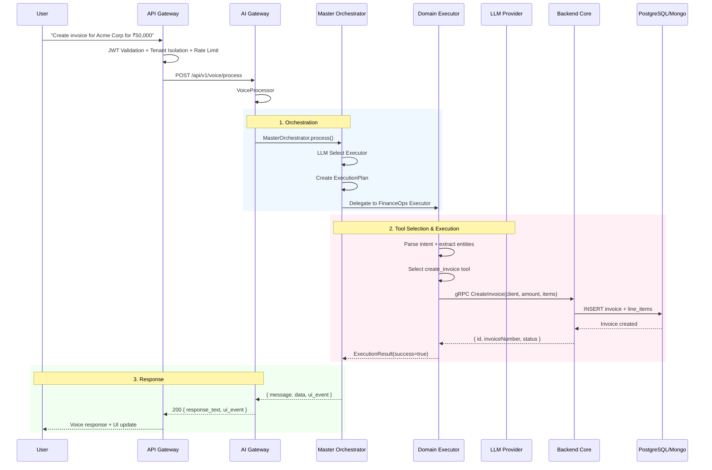
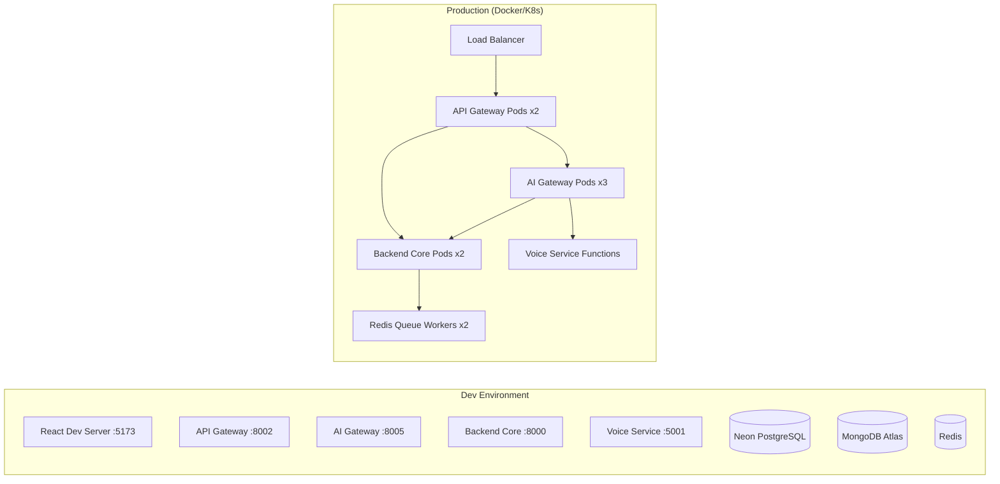

# MoneyOps: Intelligent Finance Orchestration Architecture

## Executive Summary
MoneyOps is a distributed intelligent orchestration system for financial operations through AI agents.

**Key capabilities:**
- **Multi-provider LLM Orchestration** (Groq, Cerebras, Gemini)
- **Domain-Specific Executor Agents** (FinanceOps, Compliance, Collections, TReDS, Growth)
- **Voice-to-Action Pipeline** (LiveKit > Voice Service > AI Gateway > Backend)
- **Multi-Tenant State Management** (User, Org, and Session Context)
- **Redis-backed Event & Queue System**
- **gRPC Inter-Service Communication**
- **OAuth2 + JWT Authentication**

---

## 1. High-Level Architecture

```mermaid
graph TD
    subgraph Clients
        WebApp[Web App (React/Vite)]
        VoiceClient[Voice Client (Mobile/Web)]
    end

    subgraph "API Gateway (Spring Cloud Gateway)"
        JWT_AUTH[JWT Authentication Filter]
        RATE_LIMIT[Rate Limit Filter]
        TENANT[Tenant Isolation Filter]
        ROUTER[Route to Service]
    end

    subgraph "Voice Service (Python/LiveKit Agents)"
        LiveKit[LiveKit Server]
        STT[STT: Deepgram / Groq Whisper]
        TTS[TTS: ElevenLabs / Deepgram / Cartesia]
        VAD[VAD: Silero VAD]
        GUARD[Premature Confirmation Guard]
    end

    subgraph "AI Gateway (Python/FastAPI) - The Core"
        API_GW[FastAPI Layer]
        ROUTER_AG[Agent Router]
        CEO[CEO Master Orchestrator]
        
        subgraph ExecutorAgents
            FINANCE[FinanceOps Executor]
            COMPLIANCE[Compliance Executor]
            COLLECTIONS[Collections Executor]
            TREDS[TReDS Executor]
            GROWTH[Growth Executor]
        end
        
        subgraph AgentOS
            MSGBUS[Message Bus]
            DECISION[Decision Engine]
            GOVERNANCE[Governance]
            OBSERVATION[Audit Registry]
            MEMORY[Agent Memory]
        end

        LLM[LLM Multi-Provider Adapter]
        SEMCACHE[Semantic Cache]
    end

    subgraph "Backend Core (Java/Spring Boot)"
        AUTH[Auth / JWT / OAuth2]
        REST[REST Controllers]
        GRPC[gRPC Services]
        JPA[JPA Repositories (PostgreSQL)]
        MONGO[MongoDB Document Store]
        QUEUE[Redis Queue Workers]
    end

    subgraph DataStores
        PG[(PostgreSQL / Neon)]
        MDB[(MongoDB Atlas)]
        REDIS[(Redis Cache + Queue + Session)]
        PINECONE[(Pinecone Vector DB)]
        KAFKA[(Kafka Event Bus - Config Only)]
    end

    WebApp -->|HTTP| JWT_AUTH
    JWT_AUTH --> RATE_LIMIT
    RATE_LIMIT --> TENANT
    TENANT --> ROUTER

    ROUTER -->|/api/v1/**| API_GW
    ROUTER -->|/api/auth/**| AUTH
    ROUTER -->|/api/**| REST
    ROUTER -->|/voice/**| LiveKit

    VoiceClient -->|WebRTC| LiveKit
    LiveKit --> STT
    LiveKit --> TTS
    LiveKit --> VAD
    LiveKit -->|HTTP| API_GW

    API_GW --> CEO
    CEO --> FINANCE
    CEO --> COMPLIANCE
    CEO --> COLLECTIONS
    CEO --> TREDS
    CEO --> GROWTH

    CEO --> LLM
    LLM -->|Groq/Cerebras/Gemini| LLMProv[LLM Providers]

    FINANCE -->|gRPC| GRPC
    REST --> MDB
    REST -->|Dual Write| JPA
    JPA --> PG
    QUEUE --> REDIS

    CEO --> MSGBUS
    MSGBUS --> DECISION
    DECISION --> GOVERNANCE
    GOVERNANCE --> OBSERVATION
    OBSERVATION --> MEMORY

    API_GW --> SEMCACHE
    SEMCACHE --> PINECONE
    SEMCACHE --> REDIS

    classDef core fill:#f9f,stroke:#333,stroke-width:2px;
    classDef agent fill:#aef,stroke:#333,stroke-width:1px;
    classDef infra fill:#ddd,stroke:#333,stroke-width:1px;
    class CEO,API_GW,GRPC core;
    class FINANCE,COMPLIANCE,COLLECTIONS,TREDS,GROWTH agent;
    class PG,MDB,REDIS,PINECONE infra;
```

---

## 2. Decision Pipeline (Detailed Execution Flow)


```mermaid
sequenceDiagram
    participant User
    participant GW as API Gateway
    participant AIG as AI Gateway
    participant CEO as Master Orchestrator
    participant Exec as Domain Executor
    participant LLM as LLM Provider
    participant BE as Backend Core
    participant DB as PostgreSQL/Mongo

    User->>GW: "Create invoice for Acme Corp for ₹50,000"
    GW->>GW: JWT Validation + Tenant Isolation + Rate Limit
    
    GW->>AIG: POST /api/v1/voice/process
    AIG->>AIG: VoiceProcessor
    
    rect rgb(240, 248, 255)
        note over AIG,CEO: 1. Orchestration
        AIG->>CEO: MasterOrchestrator.process()
        CEO->>CEO: LLM Select Executor
        CEO->>CEO: Create ExecutionPlan
        CEO->>Exec: Delegate to FinanceOps Executor
    end
    
    rect rgb(255, 240, 245)
        note over CEO,LLM: 2. Tool Selection & Execution
        Exec->>Exec: Parse intent + extract entities
        Exec->>Exec: Select create_invoice tool
        Exec->>BE: gRPC CreateInvoice(client, amount, items)
        BE->>DB: INSERT invoice + line_items
        DB-->>BE: Invoice created
        BE-->>Exec: { id, invoiceNumber, status }
        Exec-->>CEO: ExecutionResult(success=true)
    end
    
    rect rgb(240, 255, 240)
        note over AIG,User: 3. Response
        CEO-->>AIG: { message, data, ui_event }
        AIG-->>GW: 200 { response_text, ui_event }
        GW-->>User: Voice response + UI update
    end
```

---

## 3. AgentOS Architecture (Phase 4+)

### Core Components

1. **AgentOS Framework** (in `app/agentos/`):
   - **Message Bus** (`message_bus.py`): Inter-agent message passing with REQUEST/RESPONSE/EVENT types
   - **Decision Engine** (`decision.py`): Strategic planning and conflict resolution
   - **Governance** (`governance.py`): Policy enforcement and approval workflows
   - **Observation** (`observation.py`): Audit trail and execution logging
   - **Memory** (`memory.py`): Persistent cross-session agent state (Pinecone + Redis)
   - **Identity** (`identity.py`): Agent identity registry

2. **Domain Executors** (in `app/agents/`):
   - `FinanceExecutor`: Invoices, payments, expenses, financial summaries
   - `ComplianceExecutor`: GST filing, tax compliance, TDS validation
   - `CollectionsExecutor`: Payment reminders, overdue tracking
   - `TReDSExecutor`: Invoice discounting, working capital
   - `GrowthExecutor`: Revenue forecast, churn prediction, upsell opportunities

3. **CEO Master Orchestrator** (`master_orchestrator.py`):
   - LLM-driven executor selection
   - Morning briefing and evening summary generation
   - Agent coordination and cross-agent data synthesis
   - Never executes actions directly - always delegates

### Key Design Patterns

| Pattern | Implementation |
|:---|:---|
| **Agent Abstraction** | Domain logic hidden inside specialized executors. Router only selects which executor to invoke. |
| **Backend Adapter** | Unified gRPC + HTTP adapter for backend calls with error normalization. |
| **Stateless Gateway** | Session state stored in Redis + in-memory, enabling horizontal scaling. |
| **Tool Registry** | Each executor exposes tools registered in a central directory. |
| **Semantic Cache** | Pinecone + Redis semantic caching reduces LLM calls for similar queries. |
| **Multi-Provider LLM** | Groq primary, Cerebras/Gemini fallback providers. |

---

## 4. Voice Pipeline Architecture

```
User Speech > WebRTC > LiveKit Server > VAD (Silero)
  > STT (Deepgram/Groq Whisper) > AI Gateway /voice/process
  > Master Orchestrator > Domain Executor > Backend API
  > Response > TTS (ElevenLabs/Deepgram/Cartesia) > User Hears
```

The voice-service handles only audio I/O (STT, TTS, VAD). All business logic resides in the AI Gateway.

### Voice Guards
- **Premature Confirmation Guard**: Prevents false confirmations during COLLECTING/CONFIRMING stages
- **STT Confidence Gate**: Blocks low-confidence transcriptions (< 0.7)
- **Voice Turn Debouncing**: 600ms silence detection before processing
- **Utterance Buffering**: Incomplete utterance detection with 2s flush timer
- **Technical Leak Sanitizer**: Strips internal error messages from voice responses

---

## 5. Data Flow & Storage

| Store | Technology | Purpose |
|:---|:---|:---|
| **Primary** | PostgreSQL (Neon) | JPA entities: users, orgs, clients, invoices |
| **Document** | MongoDB Atlas | Flexible document storage for complex queries |
| **Cache** | Redis | Session state, rate limiting, queue jobs |
| **Vector** | Pinecone | Semantic cache embeddings for LLM queries |
| **Events** | Kafka (configured) | Event bus (configured, queue workers use Redis) |

### Dual-Write Pattern
The backend writes to MongoDB for operational use and PostgreSQL (via JPA) for reporting. This enables gradual migration to PostgreSQL as primary while maintaining MongoDB compatibility.

---

## 6. Deployment Topology


```mermaid
graph LR
    subgraph "Dev Environment"
        Frontend[React Dev Server :5173]
        APIGW[API Gateway :8002]
        AIGW[AI Gateway :8005]
        BACKEND[Backend Core :8000]
        VOICE[Voice Service :5001]
        PG[(Neon PostgreSQL)]
        MDB[(MongoDB Atlas)]
        REDIS[(Redis)]
    end
    
    subgraph "Production (Docker/K8s)"
        LB[Load Balancer]
        GW_Pods[API Gateway Pods x2]
        AI_Pods[AI Gateway Pods x3]
        BE_Pods[Backend Core Pods x2]
        Worker_Pods[Redis Queue Workers x2]
        Voice_Func[Voice Service Functions]
        
        LB --> GW_Pods
        GW_Pods --> AI_Pods
        GW_Pods --> BE_Pods
        AI_Pods --> BE_Pods
        BE_Pods --> Worker_Pods
        AI_Pods --> Voice_Func
    end
```

---

## 7. Service Communication Matrix

| Source | Target | Protocol | Port |
|:---|:---|:---|:---|
| Frontend | API Gateway | HTTP/REST | 8002 |
| API Gateway | Backend Core | HTTP/REST | 8000 |
| API Gateway | AI Gateway | HTTP/REST | 8005 |
| Voice Service | AI Gateway | HTTP/REST | 8005 |
| AI Gateway | Backend Core | gRPC | 50051 |
| AI Gateway | LLM Providers | HTTP | External |
